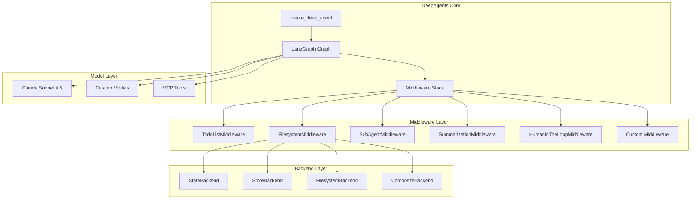

# DeepAgents As-Is Design Document

## Overview

DeepAgents is a sophisticated Python package that extends traditional LLM agents with four core capabilities: planning, filesystem management, subagent spawning, and detailed prompting. Built on top of LangGraph, it provides a modular middleware architecture that enables complex, multi-step task execution while maintaining context efficiency and enabling hierarchical task delegation.

The system addresses the limitations of "shallow" agents that simply call tools in loops by implementing deep reasoning capabilities inspired by applications like Claude Code, Deep Research, and Manus. The architecture emphasizes composability, allowing developers to mix and match capabilities based on their specific use cases.

## Architecture

### High-Level Architecture



### Component Relationships

The DeepAgents system follows a layered architecture where:

1. **Core Layer**: `create_deep_agent` factory function creates LangGraph graphs with configured middleware
2. **Middleware Layer**: Composable components that add specific capabilities (planning, filesystem, subagents)
3. **Backend Layer**: Pluggable storage systems for file operations and memory management
4. **Model Layer**: Integration with various LLM providers and tool systems

### Middleware Pipeline

Middleware components are applied in a specific order to ensure proper functionality:

1. **TodoListMiddleware**: Adds planning capabilities
2. **FilesystemMiddleware**: Provides file system tools
3. **SubAgentMiddleware**: Enables subagent spawning
4. **SummarizationMiddleware**: Manages context length
5. **AnthropicPromptCachingMiddleware**: Optimizes performance
6. **PatchToolCallsMiddleware**: Handles tool call formatting
7. **Custom Middleware**: User-defined extensions
8. **HumanInTheLoopMiddleware**: Adds approval workflows (if configured)

## Components and Interfaces

### Core Factory Function

**create_deep_agent**
- **Purpose**: Primary entry point for creating deep agents
- **Interface**: 
  ```python
  def create_deep_agent(
      model: str | BaseChatModel | None = None,
      tools: Sequence[BaseTool | Callable | dict[str, Any]] | None = None,
      *,
      system_prompt: str | None = None,
      middleware: Sequence[AgentMiddleware] = (),
      subagents: list[SubAgent | CompiledSubAgent] | None = None,
      response_format: ResponseFormat | None = None,
      context_schema: type[Any] | None = None,
      checkpointer: Checkpointer | None = None,
      store: BaseStore | None = None,
      backend: BackendProtocol | BackendFactory | None = None,
      interrupt_on: dict[str, bool | InterruptOnConfig] | None = None,
      debug: bool = False,
      name: str | None = None,
      cache: BaseCache | None = None,
  ) -> CompiledStateGraph
  ```
- **Default Configuration**: Claude Sonnet 4.5, recursion limit 1000, standard middleware stack

### Middleware Components

#### TodoListMiddleware
- **Purpose**: Provides planning and task decomposition capabilities
- **Tools**: `write_todos` - Creates and updates structured task lists
- **State Management**: Maintains todo state across conversation turns
- **Integration**: Automatically included in default middleware stack

#### FilesystemMiddleware
- **Purpose**: Manages file operations and context storage
- **Tools**: 
  - `ls` - List directory contents
  - `read_file` - Read file content with pagination
  - `write_file` - Create new files
  - `edit_file` - Perform string replacements
  - `glob` - Pattern-based file search
  - `grep` - Text search across files
- **Backend Integration**: Supports multiple storage backends via BackendProtocol
- **Large Result Handling**: Automatically saves oversized tool results to filesystem

#### SubAgentMiddleware
- **Purpose**: Enables spawning of specialized subagents for task isolation
- **Tools**: `task` - Spawns subagents with specific configurations
- **Subagent Types**:
  - **General-purpose**: Default subagent with same capabilities as main agent
  - **Custom**: User-defined subagents with specialized tools and prompts
  - **Compiled**: Pre-built LangGraph graphs as subagents
- **State Isolation**: Filters state to exclude messages and todos when passing to subagents

### Backend System

#### BackendProtocol Interface
```python
class BackendProtocol(Protocol):
    def ls_info(self, path: str) -> list[FileInfo]
    def read(self, file_path: str, offset: int = 0, limit: int = 2000) -> str
    def grep_raw(self, pattern: str, path: str | None = None, glob: str | None = None) -> list[GrepMatch] | str
    def glob_info(self, pattern: str, path: str = "/") -> list[FileInfo]
    def write(self, file_path: str, content: str) -> WriteResult
    def edit(self, file_path: str, old_string: str, new_string: str, replace_all: bool = False) -> EditResult
```

#### Backend Implementations

**StateBackend**
- **Storage**: LangGraph agent state (ephemeral)
- **Persistence**: Within conversation thread only
- **Use Case**: Default for simple applications, development, testing
- **State Updates**: Returns Command objects for LangGraph state management

**StoreBackend**
- **Storage**: LangGraph Store (persistent)
- **Persistence**: Across threads and sessions
- **Use Case**: Long-term memory, persistent file storage
- **Requirements**: Requires BaseStore instance

**FilesystemBackend**
- **Storage**: Local filesystem
- **Persistence**: Permanent on disk
- **Use Case**: Integration with existing file systems, external tool access
- **Security**: Path validation and sandboxing

**CompositeBackend**
- **Storage**: Multiple backends with path-based routing
- **Configuration**: Default backend + route mappings
- **Use Case**: Hybrid storage strategies (e.g., ephemeral + persistent paths)
- **Example**: `/memories/` → StoreBackend, everything else → StateBackend

### Subagent System

#### Subagent Configuration
```python
class SubAgent(TypedDict):
    name: str                    # Identifier for task tool
    description: str             # Shown to main agent for selection
    system_prompt: str          # Specialized instructions
    tools: Sequence[...]        # Subagent-specific tools
    model: NotRequired[...]     # Optional model override
    middleware: NotRequired[...] # Additional middleware
    interrupt_on: NotRequired[...] # HITL configuration
```

#### Subagent Lifecycle
1. **Spawn**: Main agent calls `task` tool with subagent type and description
2. **Initialize**: SubAgentMiddleware creates new agent instance with filtered state
3. **Execute**: Subagent runs autonomously with isolated context
4. **Return**: Single result message returned to main agent
5. **Cleanup**: Subagent instance destroyed, context isolated

## Data Models

### File Data Structure
```python
class FileData(TypedDict):
    content: list[str]      # Lines of file content
    created_at: str         # ISO 8601 timestamp
    modified_at: str        # ISO 8601 timestamp
```

### Agent State Schema
```python
class FilesystemState(AgentState):
    files: Annotated[dict[str, FileData], _file_data_reducer]
    
class ShellToolState(AgentState):
    shell_session_resources: NotRequired[_SessionResources]
```

### Result Types
```python
@dataclass
class WriteResult:
    error: str | None = None
    path: str | None = None
    files_update: dict[str, Any] | None = None

@dataclass
class EditResult:
    error: str | None = None
    path: str | None = None
    files_update: dict[str, Any] | None = None
    occurrences: int | None = None
```

### Tool Information
```python
class FileInfo(TypedDict):
    path: str
    is_dir: bool
    size: int
    modified_at: str

class GrepMatch(TypedDict):
    path: str
    line_number: int
    line_content: str
    match_start: int
    match_end: int
```

## Error Handling

### Path Security
- **Validation**: All file paths validated to prevent directory traversal
- **Normalization**: Paths normalized to use forward slashes and leading slash
- **Sanitization**: Tool call IDs sanitized for safe filesystem usage
- **Prefix Enforcement**: Optional allowed prefix validation for sandboxing

### Backend Error Handling
- **Graceful Degradation**: Backend failures return structured error messages
- **Fallback Strategies**: CompositeBackend provides routing fallbacks
- **State Consistency**: Failed operations don't corrupt agent state
- **User Feedback**: Clear error messages for debugging and user guidance

### Tool Execution Errors
- **File Not Found**: Structured error responses for missing files
- **Permission Errors**: Appropriate error messages for access issues
- **Content Validation**: Input validation before processing
- **Atomic Operations**: Edit operations are atomic (succeed completely or fail completely)

### Subagent Error Handling
- **Validation**: Subagent configurations validated before creation
- **Isolation**: Subagent failures don't affect main agent
- **Timeout Handling**: Long-running subagents can be interrupted
- **Resource Cleanup**: Proper cleanup of subagent resources

## Testing Strategy

### Unit Testing
- **Middleware Components**: Individual middleware functionality
- **Backend Implementations**: Each backend type with various scenarios
- **Tool Functions**: File operations, search, and manipulation
- **Utility Functions**: Path validation, content formatting, error handling

### Integration Testing
- **End-to-End Workflows**: Complete agent creation and execution
- **Backend Switching**: Testing different backend configurations
- **Subagent Integration**: Spawning and communication with subagents
- **HITL Workflows**: Human approval and interruption scenarios

### Performance Testing
- **Context Management**: Large file handling and summarization
- **Memory Usage**: Backend storage efficiency
- **Concurrent Operations**: Multiple subagent execution
- **Cache Effectiveness**: Prompt caching performance

### Security Testing
- **Path Traversal**: Validation of security measures
- **Input Sanitization**: Tool input validation
- **Access Control**: Backend permission enforcement
- **Isolation**: Subagent context separation

### Compatibility Testing
- **Model Integration**: Various LLM providers
- **Tool Compatibility**: Different tool types and formats
- **MCP Integration**: Model Context Protocol tools
- **Platform Support**: Cross-platform functionality

## Performance Considerations

### Context Management
- **Automatic Summarization**: Triggers at 170,000 tokens
- **Message Retention**: Keeps last 6 messages during summarization
- **Large Result Eviction**: Saves oversized tool results to filesystem
- **Pagination Support**: Read operations support offset/limit for large files

### Caching Strategy
- **Prompt Caching**: Anthropic prompt caching for repeated patterns
- **Model Reuse**: Shared model instances across subagents
- **Backend Optimization**: Efficient storage and retrieval patterns
- **State Checkpointing**: LangGraph state management for persistence

### Resource Management
- **Subagent Lifecycle**: Proper creation and cleanup of subagent resources
- **Memory Efficiency**: Streaming and pagination for large data
- **Connection Pooling**: Efficient backend connection management
- **Garbage Collection**: Automatic cleanup of temporary resources

### Scalability Features
- **Concurrent Subagents**: Parallel execution of independent tasks
- **Backend Scaling**: Pluggable backends for different scale requirements
- **Middleware Composition**: Modular architecture for feature scaling
- **Tool Parallelization**: Concurrent tool execution where appropriate